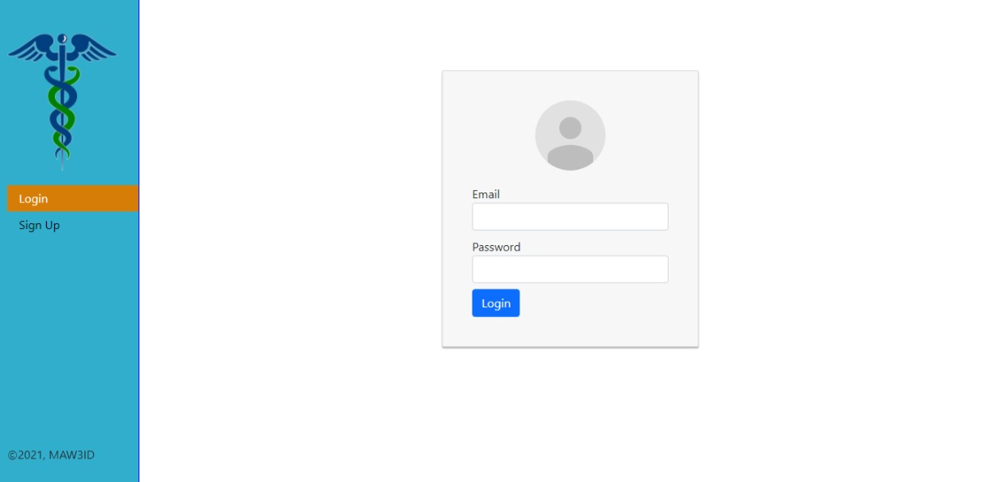

<!--
*** Thanks for checking out this README Template. If you have a suggestion that would
*** make this better, please fork the repo and create a pull request or simply open
*** an issue with the tag "enhancement".
*** Thanks again! Now go create something AMAZING! :D
-->

<!-- PROJECT SHIELDS -->
<!--
*** I'm using markdown "reference style" links for readability.
*** Reference links are enclosed in brackets [ ] instead of parentheses ( ).
*** See the bottom of this document for the declaration of the reference variables
*** for contributors-url, forks-url, etc. This is an optional, concise syntax you may use.
*** https://www.markdownguide.org/basic-syntax/#reference-style-links
-->

<!-- PROJECT LOGO -->

<br />
<p align="center">

  <h2 align="center">Mi3ad (Appiontment) Doctor's</h2>
  <p align="center">A react-redux single page responsive application, where user can see the details of doctors and book an appointment with the doctor. A user needs to sign up and login to book/delete an appointment.</p>
  <a href="git@github.com:alishabab/appointment-booking-frontend.git">
    <p align="center">  </p>
  </a>
  <p align="center">
    <a href="https://github.com/alishabab/appointment-booking-frontend/issues">Report Bug</a>
    · 
    <a href="https://github.com/alishabab/appointment-booking-frontend/issues">Request Feature</a>
  </p>
</p>

<!-- TABLE OF CONTENTS -->
## Table of Contents

* [About the Project](#about-the-project)
* [Installation](#installation)
* [Test](#test)
* [Live Link](#Live-Link)
* [Built With](#built-with)
* [Nice to have features](#nice-to-have-features)
* [Potential Future Updates](#potential-future-updates)
* [Contact](#authors)
* [Acknowledgements](#acknowledgments)

<!-- ABOUT THE PROJECT -->
## About The Project

In this project I have developed a single page application for a Hospital with react and redux libraries. App name is Mi3ad(Appiontmenty) Doctor's. A user can sign up/login to see the details of doctors and book an appointment.

App uses react router to route to different components. 
Backend APIs are developed with Ruby on Rails. [Click here](https://github.com/dasileker/final-capstone-api/tree/feature) to see backend project details.


<!-- Live Link  -->

## Live Link

<a href="https://mi3ad.herokuapp.com/">
  
</a>


<!-- INSTALLATION -->

## Installation

To run the app locally, clone the repository, navigate to it's directory.

#### Follow these commands step by step:-

```bash
git clone git@github.com:https://github.com/dasileker/mi3ad/tree/feature
cd mi3ad
npm install
npm start
```

Now go to [localhost:3000](http://localhost:3000) in your browser.

<!-- Test -->

## Test

To run unit test run `npm test` in root directory.

<!-- BUILD WITH -->

## Built With

- HTML/CSS
- React
- Redux
- React Router
- Bootstrap
- CSS Modules
- Axios
- Eslint
- Stylelint
- ES6
- NPM
- React Alert
- Font-Awesome
- Heroku for Live version deployment


<!-- Nice to have features -->

## 'Nice to have features' that are implemented
- User authentication using JWT
- Responsive to mobile and desktop screens
- React alert

<!-- potential future updates -->

## Potential Future Updates

- Department-wise doctors list
- Online fee payment
- Doctor's available slots
- Rendering Optimization

<!-- CONTACT -->
## Authors

👤 **Zerradi Amine** 
    
- [LinkedIn](https://www.linkedin.com/in/amine-zerradi/)
- [GitHub](https://github.com/dasileker)
- [Email](zerradi.amine@gmail.com)

<!-- acknowledgments -->

## Acknowledgments

- [Murat Korkmaz](https://www.behance.net/gallery/26425031/Vespa-Responsive-Redesign) for design
- [Microverse](https://microverse.org)

## Show your support

Give a ⭐️ if you like this project!

## 📝 License

This project is [MIT](https://opensource.org/licenses/MIT) licensed.